 

# Dũng Lê

### Mathematics & Informatics Undergraduate

  
  
  

A student who enjoys building practical systems with clean structure, measurable results, and thoughtful experimentation.

---

## About Me

I am studying **Mathematics and Informatics** at **Hanoi University of Science and Technology**.

I enjoy working on projects related to:

- Data science and machine learning
- Quantitative research
- Database design and analytics
- Software engineering
- Blockchain and backend development

---

## Featured Projects

<table>
<tr>
<td width="50%" valign="top">

### VN30F1M Quantitative Research

Systematic strategy research and backtesting using VN30F1M futures data.

**Highlights**
- Feature engineering from price, volume, trend, momentum, and volatility
- Signal generation and position sizing
- Risk controls and transaction-cost evaluation
- Adaptive exit rules and backtesting workflow

| Metric | Value |
|---|---:|
| Sharpe ratio | **2.17** |
| CAGR | **30.31%** |
| Maximum drawdown | **-7.98%** |
| Profit factor | **1.65** |

</td>
<td width="50%" valign="top">

### Olist E-commerce Database Analytics

A relational database and analytics workflow built from the public Olist dataset.

**Highlights**
- Data cleaning and integration
- Relational schema design and normalization
- SQL query optimization
- Revenue analysis and forecasting workflow

</td>
</tr>

<tr>
<td width="50%" valign="top">

### Chocomica — Solana Contest

A blockchain-based game project developed with a team.

**My contribution**
- Backend development
- UI-to-smart-contract integration
- Solana communication troubleshooting
- Player data access controls

</td>
<td width="50%" valign="top">

### Engineering Style

I like repositories that clearly show:
- the problem,
- the data,
- the system design,
- the results,
- and the next improvements.

</td>
</tr>
</table>

  

---

## Tech Stack

### Languages

  
  
  

### Tools

  
  

---

## GitHub Stats

---

## Contact

  

Build clearly. Learn deeply. Improve continuously.

