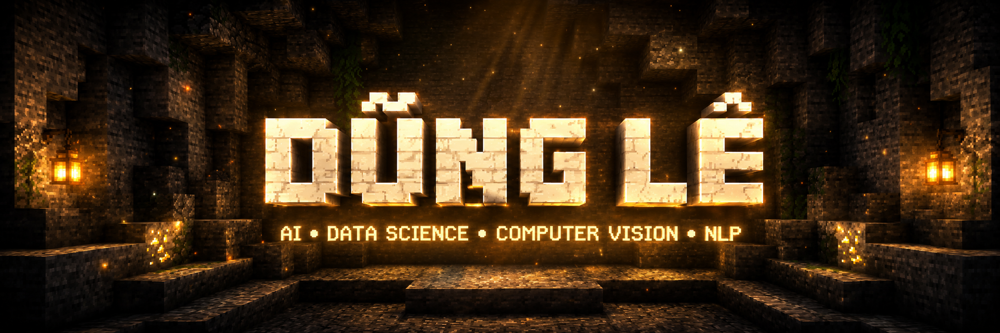
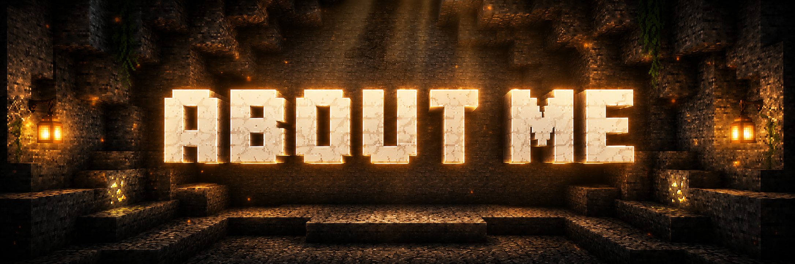
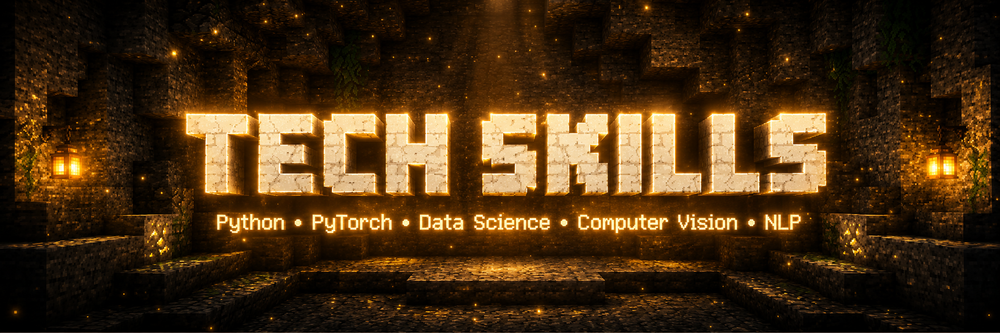
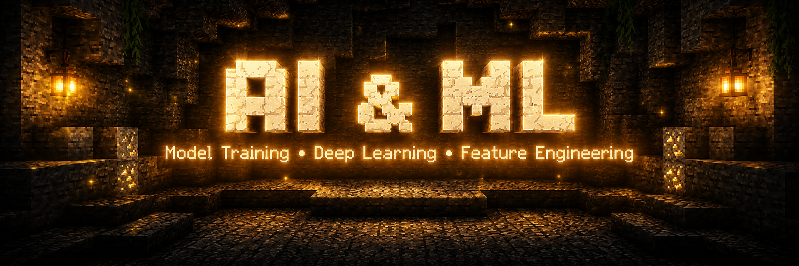
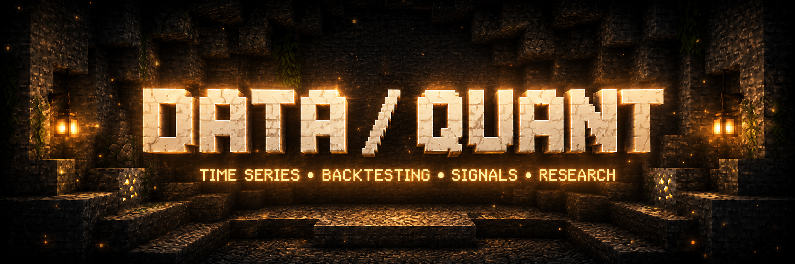
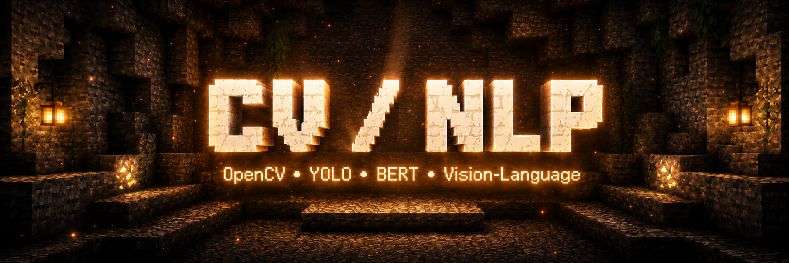
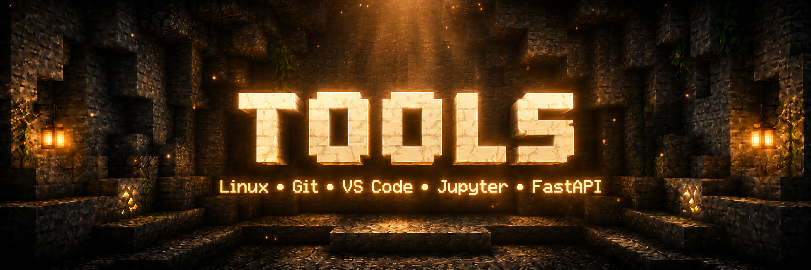

<div align="center">



# Dũng Lê

### AI · Data Science · Computer Vision · NLP · Quant Research

<p>
  
  
  
  
  
  
</p>

<sub>Building intelligent systems from data, signals, and vision.</sub>

</div>

---

<div align="center">
  
</div>

## About Me

- Passionate about turning **data into intelligence** and **ideas into working systems**
- Interested in **AI / Machine Learning**, **Data Science**, **Computer Vision**, **NLP**, and **Quant Research**
- I enjoy building practical projects around **model training**, **feature engineering**, **vision-language systems**, and **time-series analysis**
- Preferred workflow: **Python + Linux + Git + experimentation**

---

<div align="center">
  
</div>

## Tech Skills

<div align="center">

`Python` · `PyTorch` · `TensorFlow` · `scikit-learn` · `NumPy` · `pandas`  
`OpenCV` · `YOLO` · `BERT` · `Vision-Language` · `Time Series` · `Backtesting`

</div>

| Area | Highlights |
|---|---|
| **Programming** | Python, SQL, scripting, data workflows |
| **AI / ML** | Model training, deep learning, feature engineering, evaluation |
| **Data Science** | Data cleaning, EDA, feature construction, experiment tracking |
| **Computer Vision** | OpenCV, detection, segmentation, YOLO-based workflows |
| **NLP** | BERT workflows, tokenization, classification, information extraction |
| **Quant Research** | Time series, signals, backtesting, systematic research |
| **Tools** | Linux, Git, VS Code, Jupyter, FastAPI, Docker |

---

<div align="center">
  
</div>

## AI / Machine Learning

- Model training
- Deep learning workflows
- Feature engineering
- Evaluation and experimentation
- Practical ML pipelines

---

<div align="center">
  
</div>

## Data Science / Quant Research

- Time-series analysis
- Backtesting
- Signal research
- Data exploration
- Research-driven experimentation

---

<div align="center">
  
</div>

## Computer Vision / NLP

- OpenCV pipelines
- YOLO-based detection
- BERT-based text workflows
- Vision-language exploration
- Medical / applied NLP interest

---

<div align="center">
  
</div>

## Tools

<div align="center">

`Linux` · `Git` · `VS Code` · `Jupyter` · `FastAPI` · `Docker`

</div>

---

## Current Focus

```text
[█████████░] Python
[████████░░] AI / Machine Learning
[███████░░░] Data Science
[███████░░░] Computer Vision
[██████░░░░] NLP
[██████░░░░] Quant Research
```

---

## Connect

- GitHub: `github.com/Dle28`
- LinkedIn: `linkedin.com/in/dle28`
- Email: `dung.levc2810@gmail.com`

---

<div align="center">

**Thanks for visiting.**  
*Build block by block. Learn step by step.*

</div>
