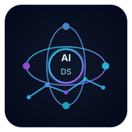

# Dũng Lê

### AI · Data Science · Mathematics & Informatics

  
  
  

<b>Building practical systems with data, experimentation, and continuous learning.</b>

<table>
<tr>
<td width="62%" valign="top">

## About Me

I am a **Mathematics and Informatics undergraduate** at **Hanoi University of Science and Technology**.

My main direction is:

- **Artificial Intelligence**
- **Data Science**
- **Machine Learning**
- **Quantitative Thinking**
- **Database Systems**
- **Software Engineering**

I enjoy turning ideas into practical projects with:

- clear structure,
- measurable results,
- reproducible workflows,
- and steady iteration.

</td>
<td width="38%" valign="top" align="center">

### Current Focus
`Python` · `Machine Learning`  
`Data Analysis` · `SQL`  
`Research Mindset` · `Problem Solving`

</td>
</tr>
</table>

## Tech Skills

### Languages

  
  
  

### AI / Data Science

  
  
  
  
  

### Tools

  
  

### Interests
`AI` · `Data Science` · `Machine Learning` · `Data Analytics` · `Database Design` · `Backend Development`

## GitHub Analytics

<table>
<tr>
<td width="50%" valign="top">
  
</td>
<td width="50%" valign="top">
  
</td>
</tr>
<tr>
<td width="50%" valign="top">
  
</td>
<td width="50%" valign="top">
  
</td>
</tr>
</table>

## Contact

  

