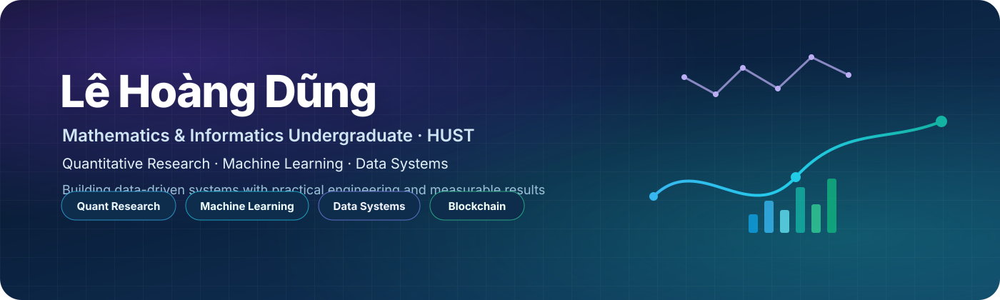
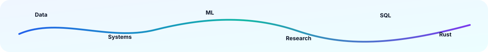

 

# Lê Hoàng Dũng

### Mathematics & Informatics Undergraduate · Quantitative Research · Machine Learning · Data Systems

  
  
  
  

  <b>Building data-driven systems with mathematical thinking, measurable results, and practical engineering.</b>

  <a href="#-featured-projects">Projects</a> •
  <a href="#-tech-stack">Tech Stack</a> •
  <a href="#-github-stats">GitHub Stats</a> •
  <a href="#-contact">Contact</a>

## About Me

I am a **Mathematics and Informatics undergraduate at Hanoi University of Science and Technology (HUST)** with project experience across **quantitative finance, machine learning, blockchain development, and database analytics**.

I enjoy turning ideas into systems that are:
- grounded in data,
- evaluated with clear metrics,
- structured for reproducibility,
- and useful in practical decision-making contexts.

<table>
<tr>
<td width="50%" valign="top">

### 🎯 Current Focus
- Systematic trading research on VN30F1M
- Feature engineering for time-series data
- Python and SQL workflows for analytics
- Clean, documented, reproducible projects

</td>
<td width="50%" valign="top">

### 🎓 Education
**Hanoi University of Science and Technology**  
Bachelor's Degree in Mathematics and Informatics  
**CPA:** 3.21 / 4.00  
**Duration:** 2024 - Expected 2028

</td>
</tr>
</table>

## 🚀 Featured Projects

<table>
<tr>
<td width="50%" valign="top">

### 📈 VN30F1M Quantitative Research

Developing and backtesting systematic strategies on **VN30F1M futures data** to support more structured and evidence-based trading decisions.

**What I built**
- Price, volume, trend, relative-momentum, volatility, and regime features
- Signal generation and position sizing
- Risk controls and transaction-cost evaluation
- Adaptive exit rules and strategy backtesting

**Training-period backtest**
| Metric | Value |
|---|---:|
| Sharpe ratio | **2.17** |
| CAGR | **30.31%** |
| Maximum drawdown | **-7.98%** |
| Profit factor | **1.65** |

`Python` `Quant Research` `Time Series` `Backtesting`

</td>
<td width="50%" valign="top">

### ⛓️ Chocomica - Solana Blockchain Contest

A blockchain-based game in which players choose competing factions and interact with logic managed through the **Solana ecosystem**.

**My contribution**
- Worked as a backend developer in a four-person team
- Connected the application UI with Solana smart contracts
- Investigated communication issues between backend and Solana
- Implemented access controls for player data

`Solana` `Rust` `Backend` `Smart Contracts`

</td>
</tr>

<tr>
<td width="50%" valign="top">

### 🛒 Olist E-commerce Database Analytics

Designed and developed a relational database system based on the public **Olist Brazilian e-commerce dataset**.

**What I worked on**
- Data cleaning and integration
- Relational schema design and normalization
- SQL query optimization
- Revenue analysis and forecasting workflow

`Python` `SQL` `MySQL` `Database Design` `Forecasting`

</td>
<td width="50%" valign="top">

### 🧠 How I Like to Build

I prefer projects that clearly show:
- problem framing,
- data assumptions,
- system structure,
- evaluation metrics,
- limitations,
- and possible next steps.

That is the style I aim to keep across my repositories.

</td>
</tr>
</table>

## 🧰 Tech Stack

### Languages

  
  
  

### Libraries & Frameworks

  
  
  
  

### Databases & Tools

  
  
  

### Areas of Interest
`Quantitative Research` · `Machine Learning` · `Database Design` · `Data Analysis` · `Blockchain Development` · `Software Engineering`

## 📊 GitHub Stats

## 🌱 Currently Exploring
- More robust research pipelines for quantitative strategies
- Better project presentation and reproducible repositories
- Practical machine learning systems
- Stronger integration between data analysis and software engineering

## 🤝 Contact

I am open to conversations around **quantitative research, machine learning, databases, and practical software projects**.

  

<b>Mathematical thinking • Clean systems • Measurable outcomes</b>

