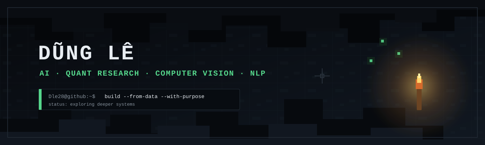

<div align="center">



<br/>

<code>AI / MACHINE LEARNING</code>
&nbsp;·&nbsp;
<code>DATA / QUANT RESEARCH</code>
&nbsp;·&nbsp;
<code>COMPUTER VISION / NLP</code>

<br/><br/>

<sub>Building intelligent systems from data, signals and pixels.</sub>

</div>

<br/>

```text
Dle28@github:~$ inspect --skills

STATUS     exploring the cave
PRIMARY    Python · Machine Learning · Quantitative Research
FOCUS      Computer Vision · Natural Language Processing
SYSTEM     Linux · Git · Jupyter · VS Code
```

## `01 / CORE STACK`

<table>
<tr>
<td width="33%" valign="top">

### AI / ML

`Python`  
`PyTorch`  
`scikit-learn`  
`NumPy`  
`pandas`

Model training · feature engineering · evaluation · fine-tuning

</td>
<td width="33%" valign="top">

### Quant Research

`Time Series`  
`OHLCV Analysis`  
`Backtesting`  
`Signal Research`  
`Risk & Position Sizing`

Market data · futures research · systematic experimentation

</td>
<td width="33%" valign="top">

### CV / NLP

`OpenCV`  
`YOLOv8`  
`Vision Transformer`  
`BERT`  
`Tokenization`

Detection · segmentation · image–text learning · text classification

</td>
</tr>
</table>

## `02 / SKILL MAP`

```text
AI / MACHINE LEARNING
├── supervised learning
├── deep learning with PyTorch
├── model training and validation
├── feature engineering
└── experiment analysis

DATA / QUANT RESEARCH
├── data cleaning and exploratory analysis
├── time-series feature construction
├── signal generation and backtesting
├── strategy evaluation
└── risk-aware position logic

COMPUTER VISION
├── image preprocessing
├── object detection
├── instance segmentation
├── visual representation learning
└── video and football analytics

NATURAL LANGUAGE PROCESSING
├── text normalization
├── tokenization
├── BERT-based modeling
├── text classification
└── medical text processing
```

## `03 / ENGINEERING TOOLS`

<p>
  
  
  
  
  
  
  
  
  
  
</p>

## `04 / CURRENT DEPTH`

```text
[████████░░] Python & data processing
[███████░░░] Machine learning
[██████░░░░] Computer vision
[██████░░░░] Quantitative research
[█████░░░░░] Natural language processing
```

<div align="center">

```text
     ⛏ keep mining · keep testing · keep building
```

<sub>github.com/Dle28</sub>

</div>
